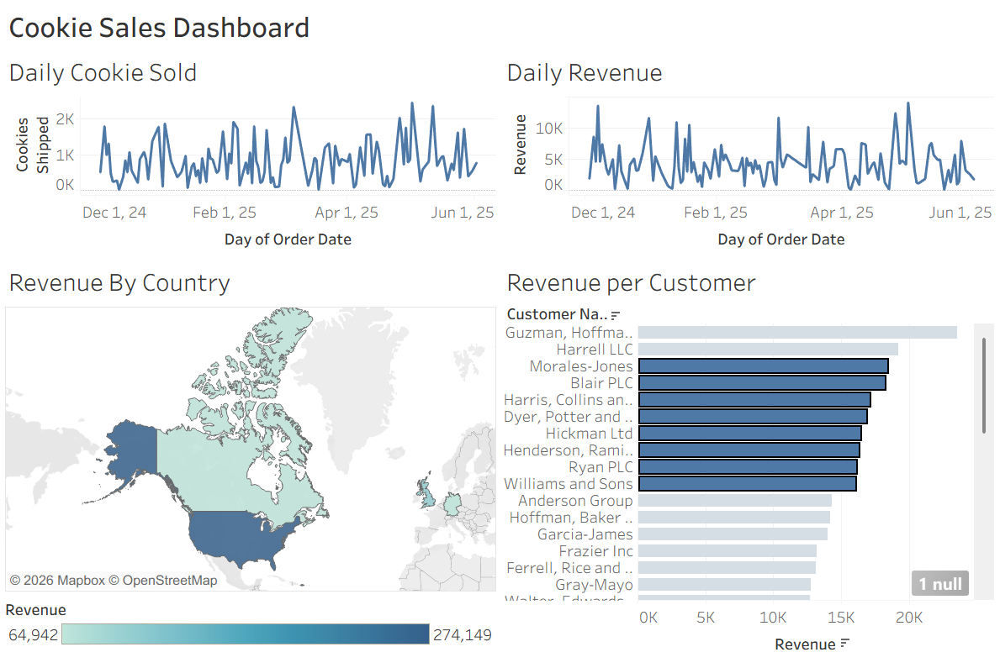

# Cookie Company Sales Dashboard
An interactive Tableau dashboard project designed to analyze cookie sales performance, revenue trends, customer insights, and geographic sales distribution using data visualization techniques.

---

## Dataset

The dataset used in this project was provided by Kevin Stratvert, including customer, country, order date, shipment, quantity sold, and revenue information.
---

## Dashboard Features

### Daily Cookie Sold
Tracks the number of cookies sold per day over time to monitor sales activity and demand trends.

### Daily Revenue
Tracks daily revenue performance over time.

### Revenue by Country
Displays country-level revenue distribution using a geographic map visualization.

### Revenue per Customer
Displays customers ranked by revenue contribution from highest to lowest.
